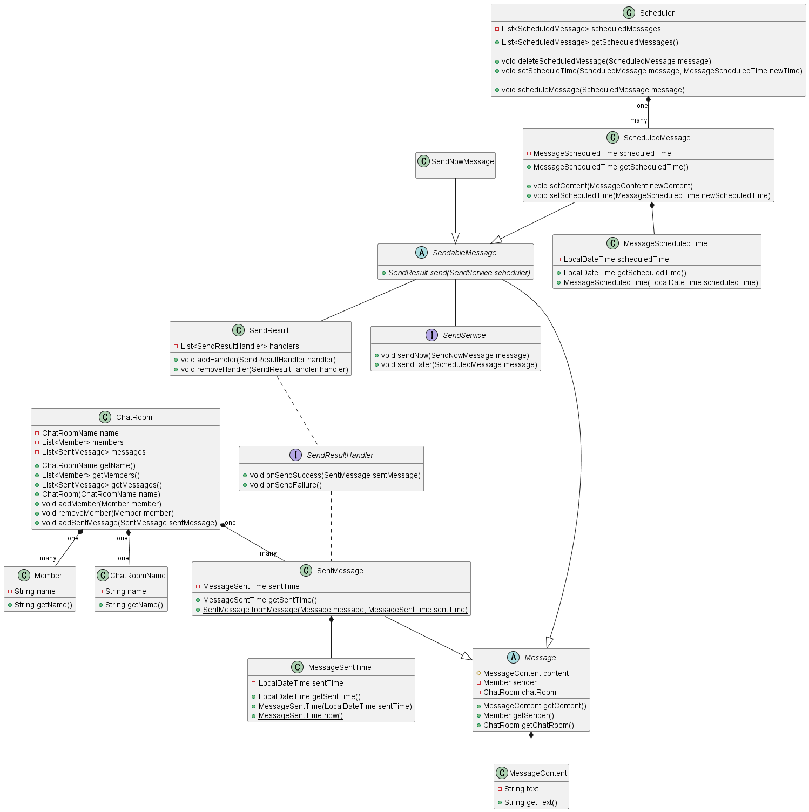

# DDD
DDD Challenge 〜 ソフトウェア設計の能力を競う！実践型コンテスト 〜 の成果物リポジトリです。

## 参加者
- [tinaxd](https://github.com/tinaxd)  
メインの実装担当

- [das08](https://github.com/das08)  
テストコード担当

その他ユビキタス言語やドメインモデル図の設計は2人で行いました。
設計・実装日数はテストを含めて3日です。

## ユビキタス言語
私たちのチームでは、本ソフトウェア設計における主要な単語を抽出し、次のように定めました。

* チャット
    * ChatRoom
    * ChatRooms
    * メンバーが複数人属していて，メッセージをやり取りするグループ．
* チャット名
    * ChatRoomName
    * ChatRoomNames
    * チャットの名前
* メンバー
    * Member
    * Members
    * このソフトウェアを利用するユーザー
* メッセージ
    * Message
    * Messages
    * あるチャットに属するメンバーがそのチャットに対して送信するもの
* 送信予定時刻
    * MessageScheduledTime
    * MessageScheduledTimes
    * メッセージが送信される予定の時刻．現在時刻より前の時刻にはなりえない．
* 送信予定のメッセージ
    * ScheduledMessage
    * ScheduledMessages
    * メッセージの送信が予約されていて，まだ送信されていないメッセージ
* スケジューラー
    * Scheduler
    * Schedulers
    * 送信予定のメッセージを送信予定時刻になったら送信するサービス

## ドメインモデル図
次に、設定したユビキタス言語をもとに、クラス図を設計しました。各クラス間は「継承」や「依存」など実際にコーディングするうえで必要不可欠な関係性を記述しています。  
設計の際の工夫した点などについては[こだわりポイント](#こだわりポイント)をご覧ください。

## こだわりポイント
- メッセージの種類を抽象クラスを使い`SendableMessage`と`SentMessage`の2つに大きく分けました
    - この両者を分けることにより`send()`メソッドを後者が持たないようにできます
- `SendableMessage`はさらに抽象クラスを使い、即時送信する`SendNowMessage`と送信予定の`ScheduledMessage`に分けています。
    - このように分離することで、`ScheduledMessage`にのみ編集・削除・送信予定時刻の変更といったメソッドを持たせることができます。
    - これらの2つのメッセージの送信扱いを容易にするために`SendService`というインターフェースを新たに定義し、各`send()`メソッド内部で`SendService`を用いて送信の振り分けができるように工夫しています。
- `ScheduledMessage`に関して、`MessageScheduledTime`クラスを別途用意することにより、送信予定時刻に関する制約をここで閉じ込めるようにしています
- チャットに存在しないメンバーはそもそもメッセージを作成できない様に、一番大元の抽象クラス`Message`で制約をかけています
- 実際にIOが発生するユースケースを考えて、`send()`メソッドを`SendResult`で返すようにしています
    - `SendResult`はハンドラーを管理し、`onSendSuccess`と`onSendFailure`を考慮するようになっています
    - このような設計にすることで、実際にAPIアクセス処理を追加する際もハンドラーに登録するだけで実現することができます
- テストコードをしっかり書いた
    - 設計したクラスとその制約を検証するためにテストコードを用意しました。
    - メインの実装とテストケースの作成者を分けることで、実装者のミスを検出できるように工夫しました。(実際に何点かテストで落とし修正しました)

## その他
- 実装について  
`lib/src/main/java/ddd`にクラスの定義およびそれらを実装したコードがあります。

- テストコードについて  
`lib/src/test/java/ddd`に各クラスの制約等を検証するテストコードがあります。  
また、コードカバレッジは[coverage](./coverage/index.html)から確認できます。(必要部分+αのコードの制約などをカバーしています)
